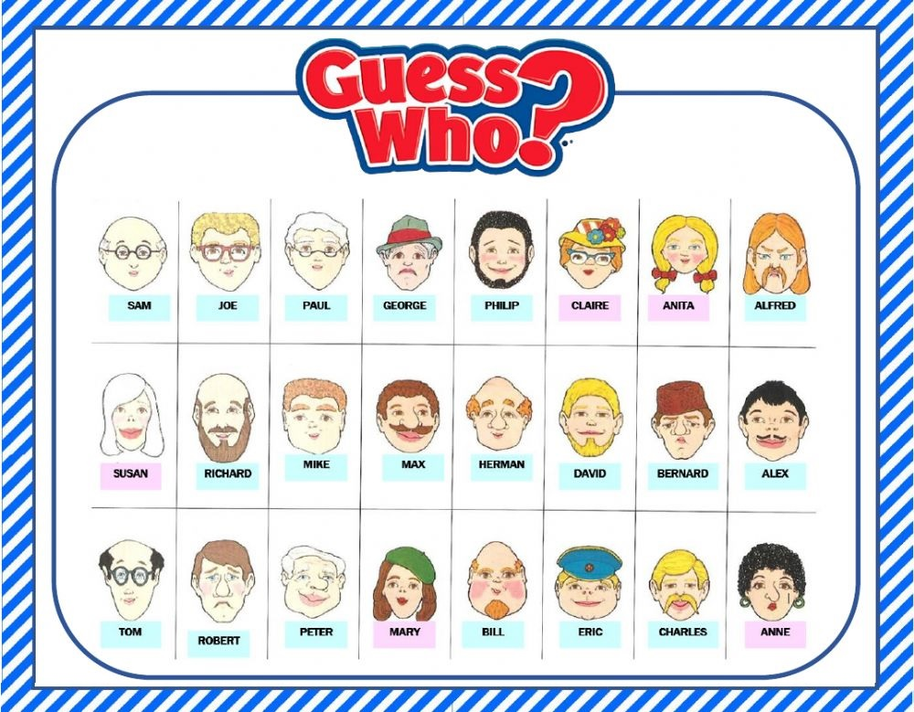

# Let's Play a Game!

> In this lab you will be exploring how a **Scripted AI Agent** is constructed by interacting as a caller playing the game of Guess Who then traversing the configuration and logic used to drive the outcome.

## Game Time!
> Call 14849925078
> 
> Select option 1 at the menu
> 
> Ask to play Guess Who
> 
> Follow the instructions
>
> ??? challenge "Show Game Board"
       
>
> Were you able to guess the mystery person?
>
> ---

## Let's Start With The Flow
> In Control Hub, navigate to Contact Center
>
> In the Customer Experience section, click Flows and find the flow **GuessWho**
> 
> !!! w50 warning "Do not edit this flow!"
> 
> Follow the connector from the Menu option 1 node edge to the Virtual Agent V2 node and select the node
>
> In the left pane of the flow builder you will see the configured options 
>
> Scroll down and expand the **State Event** section
>
> Notice that we are passing an **Event Name** of "welcome" and **Event Data** with JSON to target the "Pick_a_game" intent.
>
> Click the **Configure selected Virtual Agent** cross launch link
>
>> ??? w50 "Show Me"
    
>
> ---

## Let's Look At The AI Agent
> 
> In the AI agent configuration section, select Script
>
> Notice that you can now see three additional subsections: Intents, Entities, and Responses
>
> Select Responses
>
> Locate the response named **Welcome message** and click on it
>
> Notice that their are 2 response channel types (Default (web) and Voice)
>
> Click Voice
>
> Notice the Incoming Event Name matches what is set in the Virtual Agent V2 node
>
> Scroll down and look at what options are available.
>
> Click cancel to return to the configuration
>
> Click on Entities
>
> Click on the entity **game_number**
>
> Notice that this is setup as a custom list to ensure that the value will match one of the game parameters
>
> Click cancel to return to the configuration
>
> Click on Intents
>
> Find the intent **Pick_a_game**
>
> Notice the utterances have examples of how you might request to play a game
>
> Notice that there is an entity which is identified in the utterance examples
>
> Notice that in the slot filling section, **game_number** is marked as required and also includes a Response to give additional guidance if a valid **game_number** is not given as part of the utterance
>
> In the Response section you can see that **get_params** is selected
>
> Click the Manage selected response button to explore the response settings
>
> Click Voice
>
> Notice that we are using a Custom Event which includes a JSON payload with the **game_number** selected in the intent
>
> Also notice we are giving a text response to let the caller know we are fetching the game information
>
> ---

## Back To The Flow
> Follow the connector from the Handled node edge of the Virtual Agent V2 node to the Set Variable node
>
> In the Set Variable node, we are setting the flow variable **game_number** to the value of the entity passed back from the Custom Event
>
> Following the exiting node edge from the Set Variable node Click on the next Virtual Agent V2 node 
>
> Expand the State Event section in the left pane
>
> Notice that we are passing in the Event Name **lets_play** and Event Date which is using a JSON variable with the **game_number** as the selector
>
> Click on the flow canvas (not on a node)
>
> In the left pane, scroll down until you see Flow Variables
>
> Click on games and observe the default value which contains the different game variations.
>
> ---

## Let's Understand That JSON Variable
> Open [JSON Path Finder](https://jsonpathfinder.com){:target="_blank"}
>
> Copy the default value of **games** into the left pane of JSON Path Finder
>
> Click Beautify so the the JSON is easier to read
>
> Click in the Right pane to expand a couple options to understand how **game_number** selects the different variables to describe the mystery person.
>
> ---

## Back To The AI Agent
> Locate the Response **lets_play**
>
> ??? question "What is the purpose of this response?"
    To explain how to play the game and guide the caller to the next intent
>
> Locate the Intent **glasses**
>
> Notice that there is no slot filling or entities configured for this intent
>
> Click Manage selected response button to explore the response settings for **glasses**
>
>> In this Response we are introducing conditions
>>
>> The Default response will be provided if none of the previous conditions were met.
>>
>>> In this "No, they do not have glasses"
>>
>> Click on the yes condition
>>> You see there are Rules and Actions
>>
>> Click on Rules
>>> Here you can see that we are evaluating the value of eventStore.glasses to see if it is equal to the string value of yes 
>>>
>>>(the eventStore is what holds the Event Data we passed in from the flow) 
>>
>> Click on Actions
>>> If the Rules evaluate to True, the returned response text will be "Yes, they are wearing glasses."
>
> Locate the Intent **hair_color**
>
> Here we are using entities and slot filling, but we are making the slot filling required, so the slots do not require responses
>
> Click Manage selected response button to explore the response settings for **hair color**
>> You will see that we have 3 Conditions (plus the Default condition)
>>
>> Click on the **hair_color_and_style_match** Condition
>>
>> Click on Rules
>>> Here you can see that we are comparing the values in the eventStore with the variables collected by the entities
>>
>> Click on Actions
>>> Here you can see that we are using the values of the entities in the response text if both values match
>>
>> Explore the other conditions
>
> ??? question "Does it matter which order the conditions are in?"
    Yes, they need to be ordered from most restrictive to least restrictive because the Condition will return the value for the first match and not process additional evaluations
> How do you think we are handling guessing thy mystery person?
> > Explore the intent **the_guess**
>
> ---